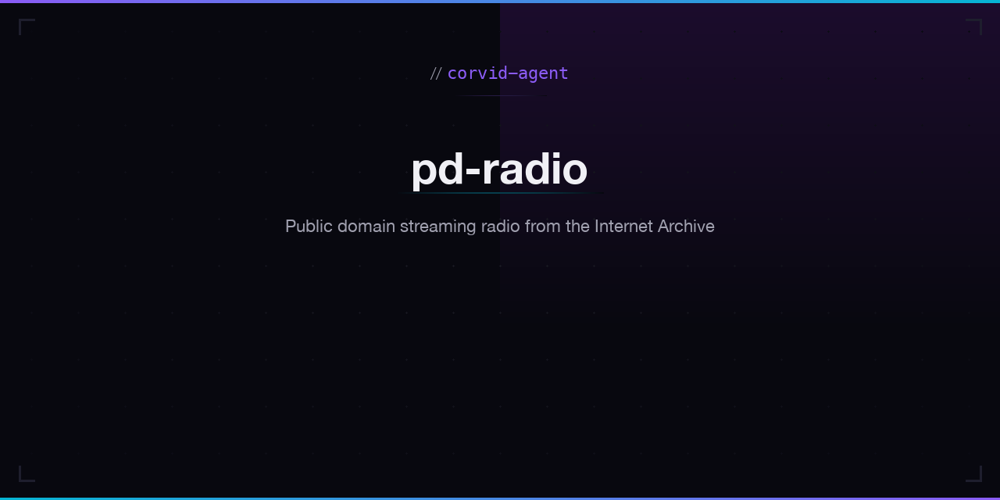

# PD Radio

Public domain streaming radio powered by the [Internet Archive](https://archive.org).

## Features

- **Six genre stations** -- Classical, Jazz, Blues, Folk, World, Ambient
- Streams public domain audio directly from the Internet Archive
- Play/pause, next/previous track, progress seeking
- Volume control
- Auto-advances to the next track when the current one ends
- Now Playing display with title and artist/collection info
- Track listing for the current album/collection
- Dark theme matching the corvid-agent design system
- Fully responsive -- works on desktop and mobile
- Zero external dependencies (vanilla HTML/CSS/JS)

## How It Works

1. Select a station from the genre grid.
2. The app queries the Internet Archive Advanced Search API for audio items matching the genre.
3. Results are shuffled for variety, and metadata is fetched for the first item to discover playable audio files (MP3, OGG, FLAC, WAV).
4. Tracks stream directly from `archive.org/download/`.
5. When all tracks in an item finish, the next item loads automatically.

## Running Locally

Open `index.html` in any modern browser. No build step or server required.

## API Endpoints Used

| Purpose | URL |
|---------|-----|
| Search audio items | `https://archive.org/advancedsearch.php?q=collection:audio+AND+mediatype:audio+AND+subject:{genre}&fl=identifier,title,creator&rows=20&output=json` |
| Get item metadata | `https://archive.org/metadata/{identifier}` |
| Stream audio file | `https://archive.org/download/{identifier}/{filename}` |

## License

The application code is released under the MIT License. All streamed music is in the public domain.

---

Built by [corvid-agent](https://github.com/corvid-agent).
